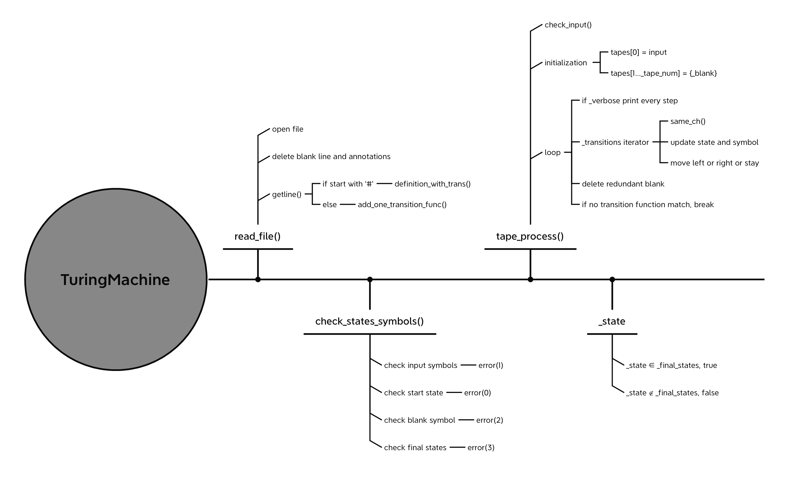
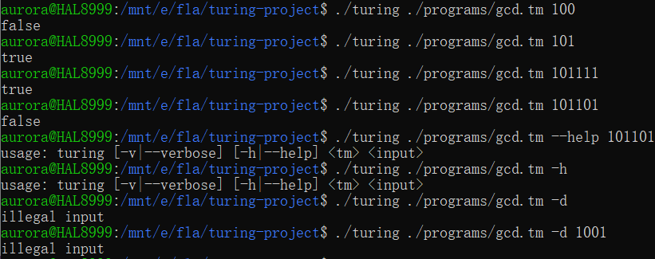
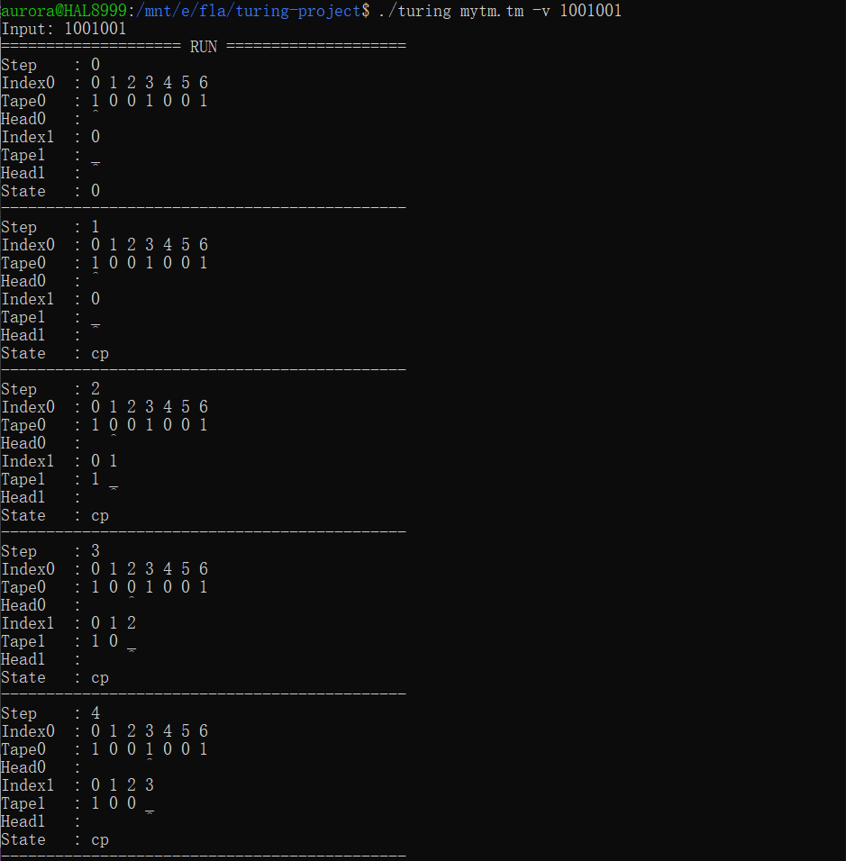
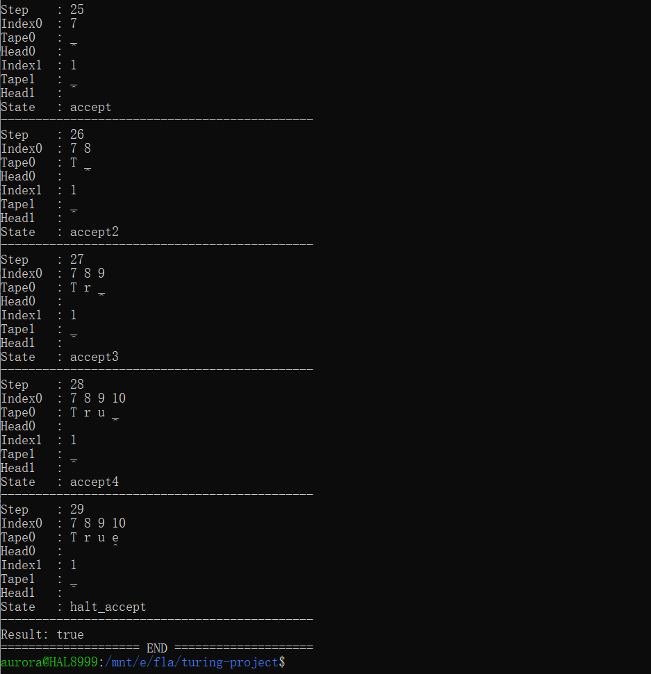

FLA Project: Turing Machine
=============

#### 1. 分析与设计思路

这个项目主要分为两个部分，``main``和``turing_machine``。

    <main>
主要处理主函数输入，即命令参数 verbose 和 help，以及需要解析的图灵机文件和输入字符串。此处处理的非法输入即参数数目不对，以及不存在的命令参数。

    <turing_machine>
主要是``TuringMachine``类。

对于在``main``函数内初始化的一个图灵机类，提供图灵机的八个参数，即需要通过输入文件初始化的部分，以及输入字符串，调试参数，输入文件等。

```cpp
class TuringMachine
{
private:
    string _filename;
    bool _verbose;

    set<string> _states;
    set<char> _input_symbols;
    set<char> _tape_symbols;
    string _start_state;
    char _blank;
    set<string> _final_states;
    
    int _tape_num;
    vector<trans> _transitions;

    string _input;
    string _state;
};
```

<div STYLE="page-break-after: always;"></div>

对于``TuringMachine``类，还提供了一些处理函数，即图灵机的处理流程。

```cpp
class TuringMachine
{
public:
    //构造函数
    TuringMachine(string filename, bool verbose, string input);
    //处理文件，根据 ',' 分隔字符串或字符
    void split_str(string l, set<string>& values);
    bool split_char(string l, set<char>& values, string fault);
    //读完文件后，检查合法性，包括
    //全部符号集合是否包含输入符号集合
    //开始状态是否属于全部状态集合
    //空字符是否属于全部符号集合
    //所有结束状态是否都属于全部状态集合
    void check_states_symbols();
    //处理文件中除转移函数之外的状态和符号
    void definition_without_trans(string l);
    //处理一行转移函数
    void add_one_transition_func(string l);
    //调用其它函数处理图灵机初始化文件
    void read_file();
    //判断输入字符串是否每一个符号都属于输入符号集合
    void check_input();
    //根据输入字符串和图灵机，处理状态转移
    void tape_process();
    //处理通配符
    bool same_ch(string s, string l);
    //调试函数，忽略
    void check_tm();
    //根据错误 exit 不同数
    void error(int i);
    //判断转移函数中的当前状态和下一个状态是否都属于状态集合
    bool check_if_in_set(string str, set<string> set);
    //判断转移函数中的每一个符号是否属于符号集合
    bool check_if_in_set(char str, set<char> set);
};
```

<div STYLE="page-break-after: always;"></div>

从输入到输出的总体流程：



#### 2. 实验完成度

    输入判断



<div STYLE="page-break-after: always;"></div>

    verbose 模式



<div STYLE="page-break-after: always;"></div>



    实验三及其说明见``./programs/gcd.tm``。

<div STYLE="page-break-after: always;"></div>

#### 3. 实验中遇到的问题及解决方案

1. 类及类中的参数中涉及到的数据结构，因为不熟悉，中间遇到了一些问题。比如，最开始对于转移函数使用的数据结构是``map``，内部使用两个``struct``，但是由于文件中会有通配符，不为了实现匹配，需要在每次储存的时候循环把通配符展开，或者在进行匹配的时候需要展开，就比较麻烦。于是改用外部``set``，内部是一个包含五个``string``的``struct``，但是``set``需要任意两个元素可比较，所以不能使用，除非内部重构``<``和``>``，于是直接将外部结构改成了``vector``。

2. 在检验开始状态是否属于所有状态这一步时，打印出来的状态是相同的，但是两个字符串不相等。因为在``getline``时，读出来的``string``会有一位结尾符，而总状态因为处理了后半个括号，所以删没删除非常明显。后来尝试了几个输入和边缘条件后，找到了这个问题。

#### 4. 总结感想

1. 在这个实验过后，对于多带图灵机和其中使用的数据结构都有了更深刻的理解。

2. 实验中涉及很多不同的情况和出错处理，为了避免崩溃，需要考虑很多出错的情况。

3. 由于这是一个比较大的实验，为了方便调试，需要在各个部分分别调试。